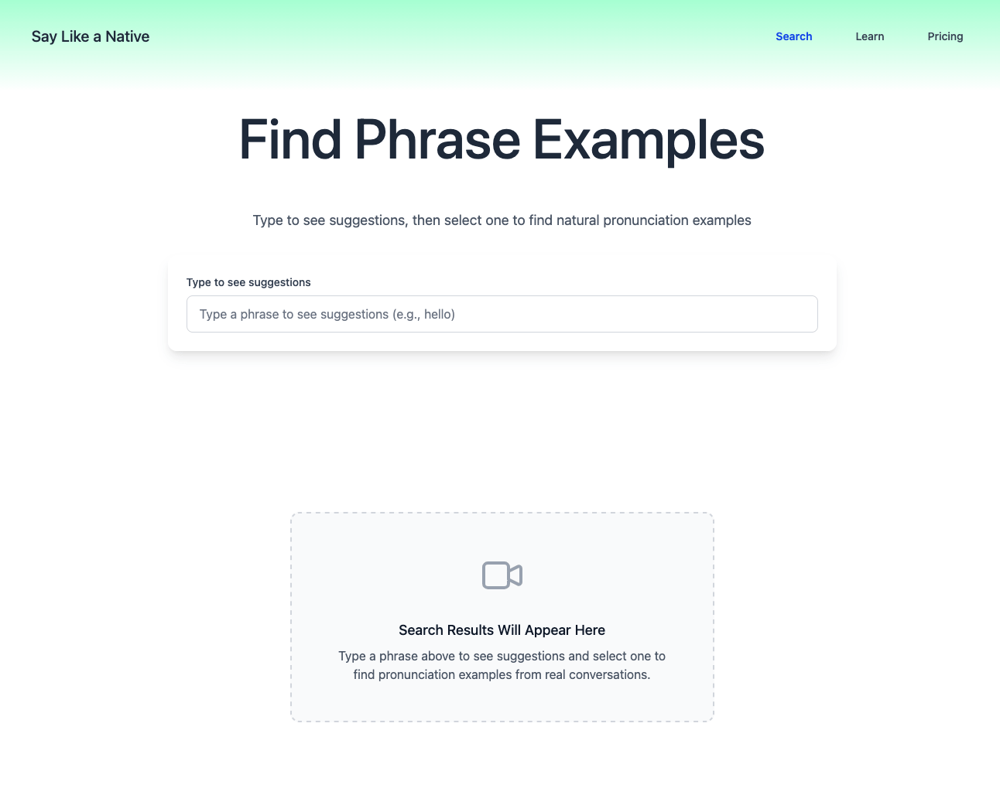

# Say Like a Native

A full-stack application that lets users search a phrase and instantly get YouTube clips where native speakers say that phrase. Designed for natural language learning using real conversational audio.

## How It Works

1. User enters a phrase in the UI
2. Backend queries OpenSearch for transcript matches
3. Matching videos and timestamps returned
4. UI displays clickable YouTube segments that jump to the phrase

## System Architecture

**Frontend**

- Next.js + Tailwind CSS
- Hosted on Vercel

**Backend**

- FastAPI REST services
- Containerized with Docker on AWS EC2

**Data + Search**

- Custom ingestion pipeline to collect and process transcript data
- Indexed and queried using OpenSearch
- OpenSearch and backend services run in Docker on EC2

## Future Improvements

- More languages
- User accounts and saved searches
